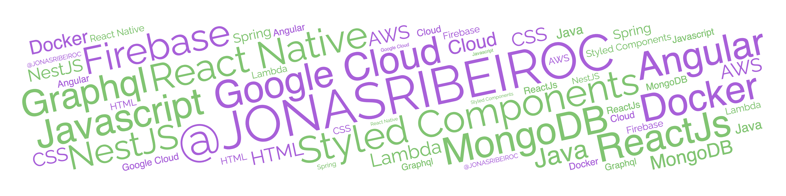

## About me

#### Senior Software Engineer
I'm a seasoned software engineer with over 12 years of practical experience, deeply passionate about staying on the cutting edge of technology. My primary expertise lies in backend technologies such as **Node.js**, **Java**, and **AWS**, while I'm also well-versed in frontend tools like **React** and **Vue.js**. I possess a comprehensive skill set, encompassing everything from understanding project requirements to managing the entire development process.

My hands-on experience means that I don't just write code; I also excel in optimizing it, enhancing its performance, and building complete websites from the ground up. Additionally, I have a knack for troubleshooting and resolving intricate issues, and my reputation is built on my reliability and accountability in every task. I maintain a strong commitment to my professional growth and development. In essence, I am a highly proficient and dependable software engineer

## Contributions

